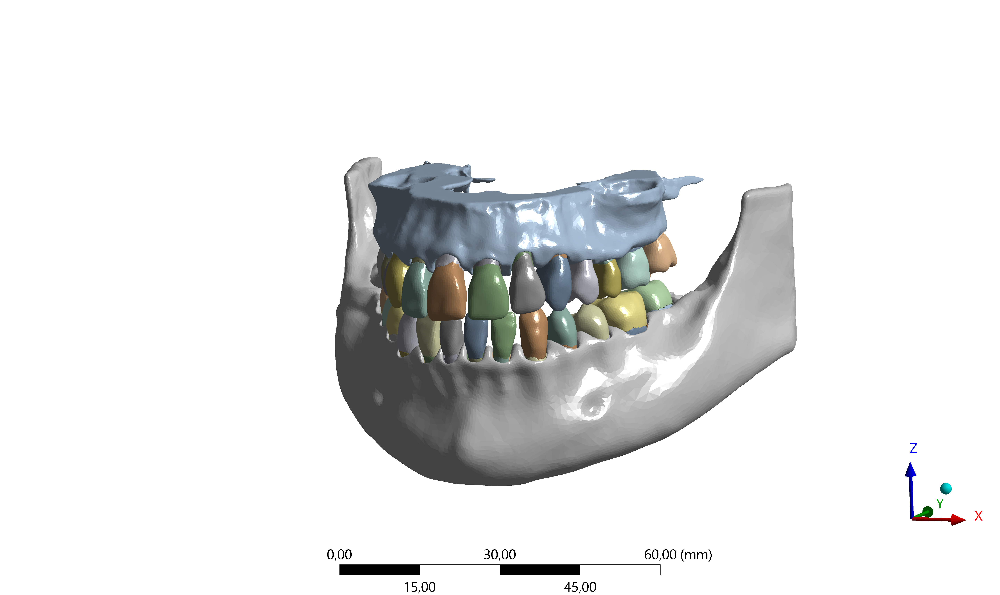
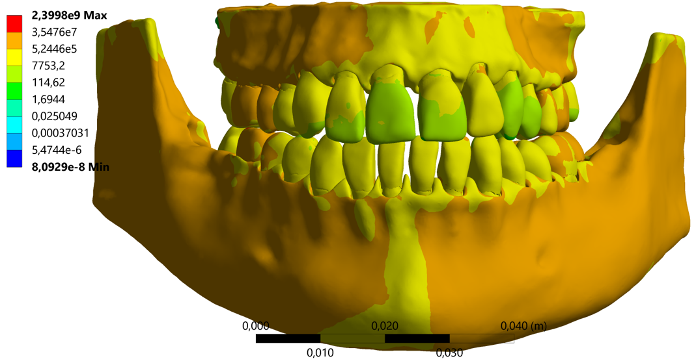

<!DOCTYPE html>
<html lang="ru">
<head>
  <meta charset="UTF-8">
  <meta name="viewport" content="width=device-width, initial-scale=1.0">
  <title>Информационные технологии в стоматологической биомеханике</title>
  
</head>
<body>

<header>
  <h1>Информационные технологии в стоматологической биомеханике</h1>
</header>

<nav>
  <a href="#intro">Введение</a>
  <a href="#theory">Теория</a>
  <a href="#examples">Примеры</a>
  <a href="#predict">Прогнозирование</a>
</nav>

<main>

<section id="intro">
  <h2>Введение</h2>
  <h3>Современные технологии</h3>
  <ul>
    <li>Компьютерное моделирование зубов и протезов для анализа распределения жевательной нагрузки.</li>
    <li>Использование методов конечных элементов (FEA) для выявления критических зон зуба и костной ткани.</li>
    <li>Применение виртуальной и дополненной реальности для планирования лечения и обучения студентов стоматологии.</li>
    <li>Цифровые базы данных пациентов и телемедицинские системы для удалённого мониторинга состояния зубов и имплантов.</li>
  </ul>

  <h3>Задачи применения ИТ</h3>
  <ul>
    <li>Повышение точности планирования стоматологического лечения.</li>
    <li>Оптимизация формы, материала и расположения зубных имплантов.</li>
    <li>Сокращение времени и затрат на клинические исследования за счёт виртуального тестирования.</li>
    <li>Прогнозирование долговечности конструкций и снижение риска осложнений.</li>
  </ul>
</section>

<section id="theory">
  <h2>Теоретические основы биомеханики зубов</h2>

  <h3>Биомеханика зуба</h3>
  <ul>
    <li>Изучение распределения сил при жевании и нагрузок на зубы, корни и окружающую костную ткань.</li>
    <li>Оценка напряжений в коронках, мостах и имплантах при различных жевательных сценариях.</li>
    <li>Моделирование усталостной прочности зубов и протезов для прогнозирования долговечности конструкций.</li>
    <li>Изучение взаимодействия между зубами и костной тканью при нагрузке.</li>
  </ul>

  <h3>Методы и технологии</h3>
  <ul>
    <li>Метод конечных элементов (FEA) для моделирования напряжений и деформаций зубов и имплантов.</li>
    <li>Цифровое 3D-сканирование и моделирование зубного ряда для анализа анатомии и нагрузок.</li>
    <li>Виртуальная и дополненная реальность для визуализации результатов моделирования и планирования лечения.</li>
    <li>Анализ данных и машинное обучение для прогнозирования долговечности протезов и выявления потенциальных проблем.</li>
  </ul>
</section>

<section id="examples">
  <h2>Примеры применения</h2>

  <h3>Компьютерное моделирование</h3>
  <ul>
    <li>Моделирование распределения нагрузки на зубы и импланты для выявления зон риска разрушения.</li>
    <li>Определение оптимальной формы коронок и мостов для равномерного распределения нагрузки при жевании.</li>
    <li>Тестирование различных материалов (металл, керамика, композиты) без проведения клинических испытаний.</li>
  </ul>

  <!-- Первая: локальная картинка -->
  

  <h3>Распределение нагрузки</h3>
  <ul>
    <li>Красным обозначены зоны максимальной нагрузки.</li>
    <li>Жёлтым — средняя нагрузка.</li>
    <li>Зелёным — минимальная нагрузка.</li>
    <li>Эта визуализация помогает планировать расположение имплантов и коронок для минимизации риска разрушения.</li>
  </ul>

  <!-- Вторая: локальная картинка -->
  

</section>

<section id="predict">
  <h2>Прогнозирование долговечности</h2>

  <h3>Методы</h3>
  <ul>
    <li>Численное моделирование усталости протезов и имплантов.</li>
    <li>Статистический анализ и машинное обучение для предсказания срока службы стоматологических конструкций.</li>
    <li>Оптимизация конструкции и материалов под индивидуальные нагрузки пациента.</li>
  </ul>

  <h3>Преимущества</h3>
  <ul>
    <li>Снижение риска разрушения зубов и протезов.</li>
    <li>Повышение точности лечения и планирования стоматологических вмешательств.</li>
    <li>Сокращение времени и затрат на клинические испытания.</li>
    <li>Возможность создания индивидуальных планов лечения с учётом распределения нагрузок и долговечности конструкций.</li>
  </ul>
</section>

</main>

<footer>
  
&copy; 2025 Информационные технологии в стоматологической биомеханике

</footer>

</body>
</html>
